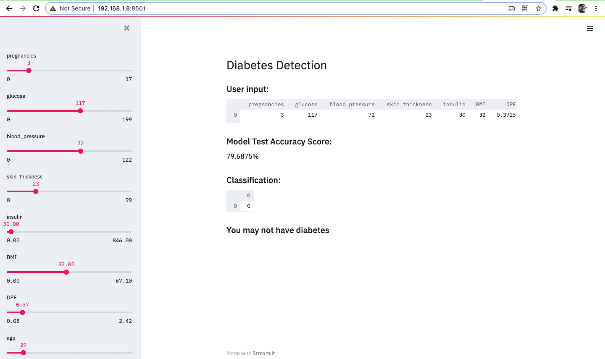

# Diabetes Prediction Web Application
This web application takes the values of pregnancies, glucose, blood pressure, skin thickness, insulin, BMI, DiabetesPedigreeFunction, Age and determines whether a person may have diabetes or not.

This model was trained using random forest classifier for better accuracy

## Libraries used: 
pandas, Scikit-learn, Pillow, streamlit

